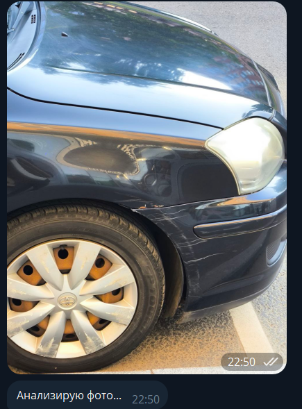
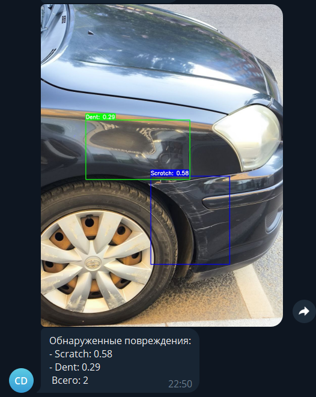

# 🚗 Car Damage Detection Telegram Bot

## Описание проекта

Это Telegram-бот для автоматического обнаружения и классификации повреждений автомобилей на фотографиях. Пользователь отправляет фотографию автомобиля, а бот возвращает ту же фотографию с отмеченными повреждениями (вмятины, царапины, трещины, разбитые стекла, сломанные фары, спущенные шины) и список обнаруженных повреждений.


## Содержание
- [Возможности](#возможности)
- [Технологии](#технологии)
- [Датасет](#датасет)
- [Обучение](#обучение) 
- [Установка](#установка)
- [Деплой через Docker](#деплой-через-docker)
- [Использование](#использование)

## Возможности

- **Детекция 6 типов повреждений:** Вмятина (Dent), Царапина (Scratch), Трещина (Crack), Разбитое стекло (Glass shatter), Сломанная фара (Lamp broken), Спущенная шина (Tire flat).
- **Визуальное отображение:** Нанесение ограничивающих рамок и меток на исходное изображение.
- **NMS:** Фильтрация боксов с помощью NMS для точных результатов.
- **Telegram Bot Interface:** Удобный интерфейс Telegram-бота для загрузки изображений и получения результатов.
- **Оптимизированный инференс:** Использование `ONNX Runtime` для быстрого и эффективного выполнения модели.
- **Контейнеризация:** Готовый `Dockerfile` для легкого развертывания и воспроизводимости.


## Технологии
- **Python 3.11**: Основной язык программирования.
- **YOLO11**: Модель для детекции объектов.
- **ONNX Runtime**: Оптимизация и инференс модели.
- **OpenCV**: Предобработка и визуализация изображений.
- **pyTelegramBotAPI**: Фреймворк для Telegram-бота.
- **Docker**: Контейнеризация приложения.
- **Git LFS**: Хранение больших файлов модели.

## Датасет
Модель обучена на датасете [CarDD](https://cardd-ustc.github.io), который включает:
- 4,000 изображений автомобилей с повреждениями.
- 9,000 аннотаций для шести категорий: Dent, Scratch, Crack, Glass shatter, Lamp broken, Tire flat.

## Обучение
Для детекции повреждений автомобилей использовались модели YOLO11m и YOLO11l из семейства YOLO11. Обучение проводилось на датасете [CarDD](https://cardd-ustc.github.io) с использованием Google Colab (см. [Jupyter Notebook](https://github.com/Maximusin/car-damage-detector/main/Car_Damage_Train.ipynb))

### Основные этапы:
1. **Подготовка данных**: Аннотации в формате COCO конвертированы в формат YOLO с помощью `ultralytics.data.converter`.
2. **Обучение моделей**:
   - **YOLO11m**: 50 эпох, размер изображений 640x640, batch size 8.
   - **YOLO11l**: 40 эпох, размер изображений 640x640, batch size 16, с усиленной аугментацией.
   - **YOLO11l (высокое разрешение)**: 40 эпох, размер изображений 1024x1024.
3. **Экспорт**: Модели экспортированы в формате ONNX для оптимизированного инференса через 'ONNX Runtime'.
4. **Результаты**:
   - YOLO11m: mAP50: 0.726, mAP50:95 = 0.576.
   - YOLO11l (imgsz=640): mAP50: 0.772, mAP50:95 = 0.609.
   - YOLO11l (imgsz=1024): mAP50: 0.731, mAP50:95 = 0.539.


## Установка
1. **Клонируйте репозиторий** (с Git LFS для модели):
   ```
   git clone https://github.com/Maximusin/car-damage-detector.git
   cd car-damage-detector
   git lfs install
   git lfs pull
   ```
2. **Установите зависимости**
   ```
   pip install -r requirements.txt
   ```
3. **Запустите бот локально (замените token на токен вашего Telegram-бота)**

   *Для Linux/macOS:*
   ```
   export TOKEN='token'
   python main.py
   ```
   *Для Windows (PowerShell):*
   ```
   $env:TOKEN='token'
   python main.py
   ```
## Деплой через Docker
1. **Соберите Docker-образ**
   ```
   docker build -t car_damage_detector .
   ```
2. **Запустите контейнер (замените token на токен вашего Telegram-бота)**
   ```
   docker run --name CarDD -d -e TOKEN='token' car_damage_detector
   ```
## Использование
1. Запустите бот, отправив команду /start.
2. Загрузите фотографию автомобиля.
   
3. Получите аннотированное изображение с обнаруженными повреждениями и текстовое описание результатов.
   
